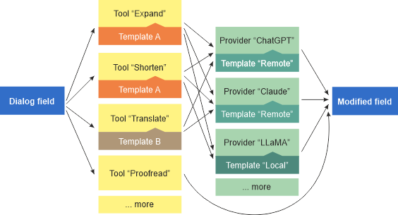

# EToolbox Authoring Insider

***

EToolbox Authoring Insider (or simply _Insider_) is part of Exadel Toolbox for Adobe Experience Manager. It is a micro-framework for automating routine operations in AEM's authoring interface with possible use of artificial intelligence.

### Features

_Insider_ plugs in different points in the AEM authoring interface, such as:
- component dialogs;
- page properties;
- in-place editors, etc.

_Insider_ offers instrumentation for modifying content of AEM dialog fields and properties using customizable tools and integrations with third-party providers, such as AI or search engines.

_Insider_ appends to input fields (text fields, textarea-s, RTE fields) and provides different **tools** (= "commands") to change field content. These are such commands as "expand text", "compact text", "do translation". "summarize", etc.

Every tool is a separate JS script that follows a certain format and is registered in the framework. There are out-of-box tools/scripts. Users can create tools/scripts of their own. Also, users can define for each tool for what fields it is available.

There are also tool **templates** that allow creating tool variations without writing any code. Usually the variations created upon a template differ in their prompts to AI. Other tools are individual (= "equivalent" to their internal template).

When a tool requires an integration with AI or some other third-party service, it uses a **provider**. A provider is yet another JS script that implements some logic needed for the integration.

A provider, same as a tool, can be based on a template. A user is able to introduce a new provider as a variation of an existing one (to say, with another system prompt, or addressing to another network endpoint). Using providers, you can employ different LLMs, be them publicly available or private, for different commands within the same AEM interface. 

### System requirements

_Insider_ is compatible with AEM 6.5.12 and later versions. It requires a Java 8 runtime.

### Installation

_Insider_ is installed into an AEM instance via the Package Manager or else with an AEM project deployment pipeline. _Insider_ can be removed via the Package Manager.

Upon installation, _Insider_ unpacks the three module packages: _ui.apps_, _ui.config_, and _ui.content_, and also a Java code bundle. _Insider_'s icon is added to the AEM start menu, under the "EToolbox" section.

### Setup

Read the manual [here](docs/setup.md).

### Working with tools and providers

Read the manual [here](docs/usage.md).

### Contributing

We welcome contributions to the project. Please read the [Contributing](CONTRIBUTING.md) guide.

### Licensing

This software is licensed under the [Apache License, Version 2.0](./LICENSE).