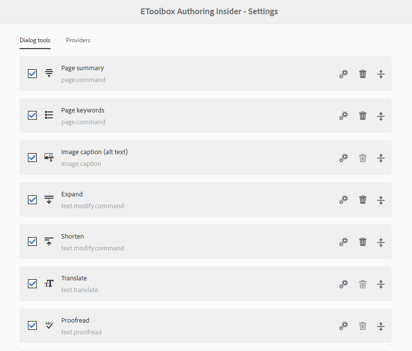
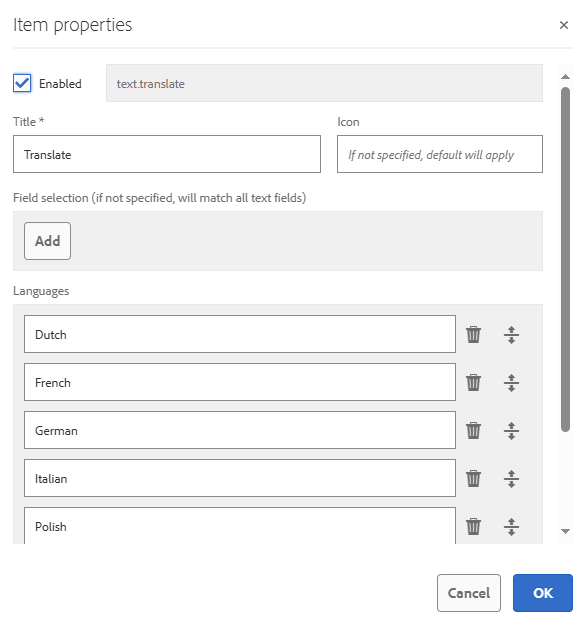

## EToolbox Authoring Insider - Setup

Follow the _Insider_'s icon to the [Settings](http://localhost.hpe.com:4502/etoolbox/authoring-insider.html) page. You will see several tabs in the page.



### Dialog tools

The *Dialog tools* tab is the list of present tools. Each of the tools can be enabled or disabled with a checkbox. Those tools that are deactivated will not be displayed in tool dropdowns in AEM dialogs.

The tools can be dragged up and down. This will, naturally, change their order in a tool dropdown in an AEM dialog.

The tools can be deleted/cleaned up as well. Mind that a tool that is essentially a variation of a common templated (such as "Expand text") can be removed completely. But a tool which is unique for its own template (such as "Image caption") can only be "cleaned up." That is, the current settings of the tool are erased, but the "template" remains there and can only be disabled. Owing to this, a user always sees all the tools/templates that are technically available and is able to activate or deactivate them as they need.

Every tool can be modified by clicking the "Properties" button which opens a properties dialog. Usually the dialog allows altering the title and icon of the tool as well as its enabled status. For AI-powered tools, there is also the possibility to modify prompts and other parameters.



#### Field selection

Many tools offer the way to control "Field selection," that is, to what dialog fields in what areas the tool will attach. This setting is a multifield. Every entry is a sort of "rule" that defines the "visibility" of a tool.

A "rule" can be simply a CSS-style selector. Else it can contain one or more key-value pairs optionally preceded by a scope flag and optionally followed by a selector.
```
@ name=title|description attribute = "data-attribute" .my-title

│ └─────────────────key-value pairs─────────────────┘ └selector┘
│
└─ an optional flag that says the rule is a requrement
```

A _flag_ is optional and case-insensitive. When present, it defined the "scope" of the tool. Use _dialog_ for tools that must only be visible insider component's dialogs. Use _properties_ or _page properties_ for tools that must only be visible in page properties.

A key-value pair must start with one of the keys enumerated below, followed by one of the equals/includes operators and a value. A value containing spaces must be enclosed in quotes. You can specify several alternative values  separated with `|`.

Between the key and the value in a key-value pair, the following operators can be used:
- _=_ exactly equals;
- _^=_ starts with;
- _$=_ ends with;
- _*=_ contains (case-insensitive);
- _!=_ does not contain (and, subsequently, not equal; case-insensitive).

We process the following keys:
- _attribute_ (alias _attr_) - an arbitrary attribute of the dialog field, taken by its name (not by value). This is useful for matching numerous fields that all share the same attribute. Using a tool like _EToolbox Authoring Kit_ you can automatically mark all the fields of interest with an attribute like `data-ai-mediated` and then set up all the tools uniformly to match only those fields. Note: this key is only used with the `=` operator.
- _component_ - the name of the component for which this dialog is shown.
- _container_ (alias _parent_) - the CSS-style selector that would match an arbitrary DOM container in which the current field is located. Note: this key is only used with the `=` operator.
- _href_ (aliases _url_, _path_) - matches the address of the current page. Therefore, you can make some tools be available only in particular pages of your website.
- _label_ - the label of the dialog field.
- _name_ - the value of the `name` attribute of the dialog field. You don't need to precede it with `./`. Either "regular" text fields or RTE fields will be matched despite the latter having complex structure with the real name-bearing element nested somewhere inside the structure.
- _selector_ - a CSS-style selector the current field must match. Note: a selector can just be put after all the key-values pairs without this "introductory" key. The "selector=" key only serves for better readability.
- _tab_ - the name of the tab in the dialog.
- _ui_ - the type of interface the current field is in. Valid options are "dialog", "properties" ("page properties"), and "inplace" ("in-place"). Note: this key is only used with `=` and `!=` operators.

Usually, rules are grouped by the logical OR. That is, if there are several rules, the tool will be attached to a field if at least one of the rules is satisfied. However, if a rule is basically a negation (= it contains only key-value pair(s) with the `!=` operator), it is perceived as a generic requirement and is considered before the rest of the rules. You can make any other rule a requirement by prepending `@`. Multiple requirement rules are combined by the logical AND. 

Example: consider the following group of rules:
1) component != "Anchor"
2) @ ui = dialog
3) name="title", 
4) name=description, 
5) name = keywords.

This group of rules contains two requirements: one saying that the component name should not contain the word "Anchor", and another saying that the UI must be of component dialog type. Also, the group contains three alternative options, each saying about a possible field name. _Insider_ will attach the current tool to all dialog fields with the name "title" or "description", or "keywords" except those in the dialogs of "Anchor", "New Anchor" or "Anchor Nav" components.

Here are some valid examples of "Field selection" rules:
```
.my-field                                   // Simple CSS-style selectors.
[type="text"]:not(.my-field)

ui=properties field="jcr:description"       // Will match only fields with name "jcr:description" in page properties.

component *= "Anchor" field=title           // Will match a field with name "title" or "./title" in a dialog
                                            // of a component whose name contains "Anchor".
                                    
ui = dialog href *= "/we-retail/"|"/wknd"   // Will match all fields in dialogs of components located within pages
                                            // under "/we-retail/" or "/wknd/" section of the site. 
                                            // But NOT in page properties.
```

If the "Field selection" multifield is left empty, the tool is attached to all available text fields and RTEs.

#### Setting up prompt

Some of the tools would allow modifying the LLM prompt. If the label for the prompt textbox says that it supports user input templates, you can make _Insider_ ask for more info before prompting an LLM. An input template is a string enclosed in `{{ }}` brackets. Inside the template, you put the title of dialog and, optionally, the variants to select from. E.g., the prompt `Modify the text to {{ How do you want your text to be modified? }}` will make _Insider_ display an input dialog entitled "How you want your text to be modified?" If a user then enters a text like "comply with standards", the actual prompt sent to an LLM will be "Modify the text to comply with standards".

There is a way to display a select list instead of a text input. To do this, you need to put inside the brackets several variants separated by `|`. E.g., the prompt `Modify the text to {{ How do you want your text to be modified? | comply with standards | be more concise | be more engaging }}` will make _Insider_ display a select list with three options.

If a prompt supports user-input templates, it may contain any number of templates. Multiple input windows will be displayed sequentially.  

#### Adding a new dialog tool

Click the "Add" button to add another template-based tool (or "variation"). Select the template in the dialog that opens, and wait for the complete tool properties dialog to appear. After submitting the dialog, drag the newly created tool variation to a desired position in the list. 

### Providers

The *Providers* tab allows creating, modifying, and deleting/cleaning up providers. Working with this tab follows the same principle as described above.

Speaking about AI integrations, _Insider_ distinguishes templates for _external_ and _own_ providers. External providers are accessed via AEM instance and, therefore, allow extensive access control and/or keeping access tokens. A connection to ChatGPT can serve as an example. "Own" providers are to be accessed directly from the user's browser. They are usually used for testing purposes or for the cases when the user has access a private AI model.  

Most important is the possibility to reorder providers. Because a _tool_ can consume different providers, there must be a default ("first-choice") provider. This is the one that is situated in the lost above other providers for the same tool.

#### Setting up feature support

Some providers will offer int their properties dialogs a multifield with the name like "Support constraints". It allows setting up matching between the tools and providers. A _tool_ may have its feature requirements declared in the `requirements: [...]` section of the tool registration statement. Usually, requirements include a mere ID of a tool. Depending on the tool, there can be more requirements.

If a provider's support setting is empty, it will match any requirement. Otherwise, the "Support constraints" multifield can contain some lines like `"image"` or `"!text"`. The former is a positive match: the provider will match a requirement if it has a support setting that equals to the line, or else _starts with_ the line. The latter is a negative match: the provider will match a requirement if it does NOT equal or starts with the given line. See the examples below:

| Requirement | Support setting | Result     |
|-------------| --------------- |------------|
| image       | image           | _match_    |
| image.create| image           | _match_    |
| text        | image           | _no match_ |
| text.expand | !image          | _match_    |

Note: the `!`-starting settings take precedence over the positive ones: if you, e.g., set up a provider to match `!image`, it will match any requirements such as `text`, `audio`, etc., because they are "no images".

Also, a provider always matches a requirement which is the name of a method declared in the registered provider model.

If a tool introduces multiple requirements, a provider must match _all_ of them to be available for the tool.

#### Adding a new provider

Click the "Add" button to add a new provider. Select the provider type in the dialog that opens, and wait for the complete provider properties dialog to appear. After submitting the dialog, drag the newly created provider to a desired position in the list.
