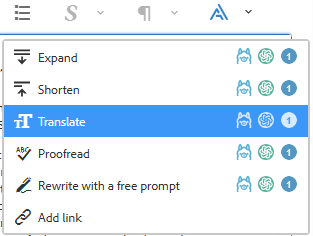
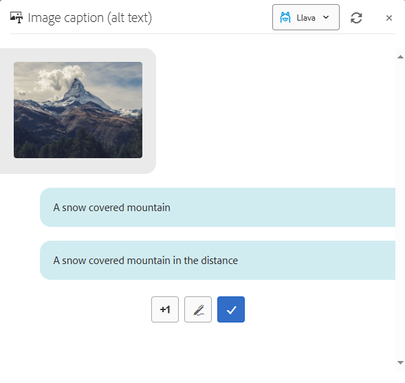

## EToolbox Authoring Insider - Usage

Create or open a webpage in AEM in edit mode. Then, open a component's dialog that contains text fields or RTEs. You will most probably notice a  button. Click it, and you will receive a dropdown of tools that are available for the current field.

Small buttons beside each tool in the picture manifest the providers that are available for the current tool. (There are no provider icons if a provider is not required, or else there's only one, or, on the contrary, there are too many to display.) If a user simply clicks the menu item, the default provider is used. If a user clicks a provider icon, the tool is executed with this provider.

After clicking on a tool, a chat dialog usually opens.

The chat dialog features both the user's input and the responses by _Insider_. As a rule, under the last _Insider_'s response, there are "quick reactions" buttons. A user can request another variant, or type in an own command or clarification, etc. The blue "checkmark" button is to accept the last response. (If responses are many, a separate checkmark button pops up beside each of them.)

From the dialog's header, a user can switch to another provider by selecting it in a dropdown, and also "restart" the current dialog.

Some tools are designed to have additional dialog steps. E.g., a translation tool opens a window to select the needed language before entering the chat dialog. Some other tools can do without a chat dialog since they present non-AI-based facilities.

After a response is accepted, its text is inserted into the current field. If there was a selection inside the field, the response normally replaces just the selected part. 